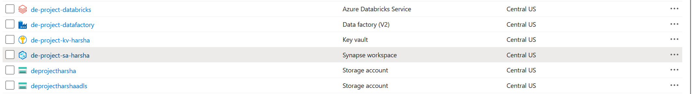
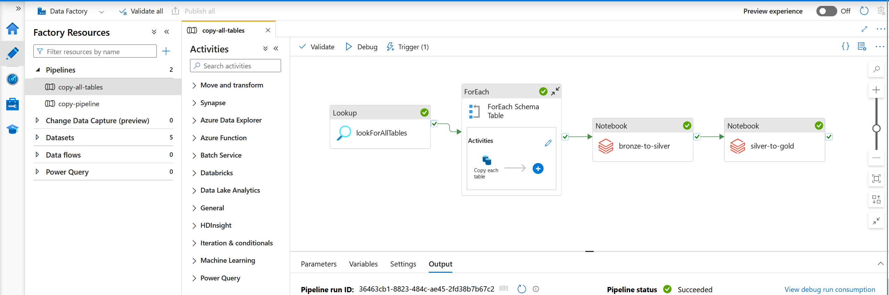
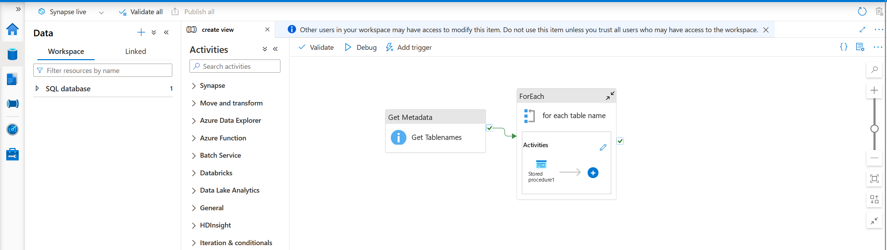
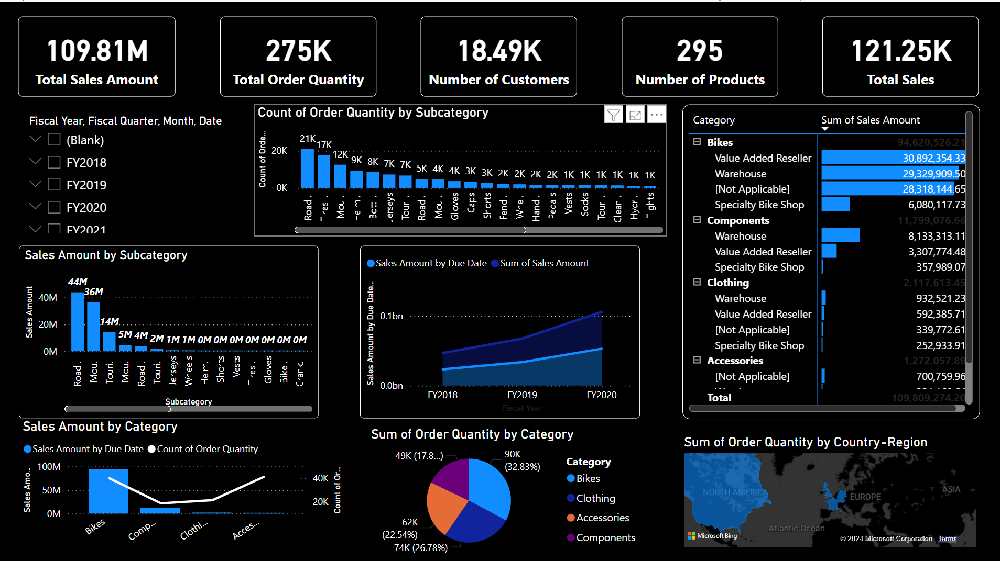

# AdventureWorks-de
A complete data engineering project with the creation of pipelines and report generation

# A complete data engineering project using Adventure Works database
This project includes :
1. Building a pipeline to ingest data from an onpremise SQL Server database using Azure Data Factory.
2. Storing the data on Azure Data Lake Storage Gen2.
3. Transforming the raw data into usable form on Azure Databricks
4. Using Azure Synapse Analytics to load the final form of data
5. Creating an interactive dashboard using Power BI

The pipeline is completely automated. Any changes do the database triggers a re-run of the pipeline, and updates our entire work completely upto the end point at the dashboard.

# Resources within the resource group in Azure:

# Complete end to end pipeline:

# Synapese Analytics pipeline to create store procedures:

# Final Power BI dashboard:

